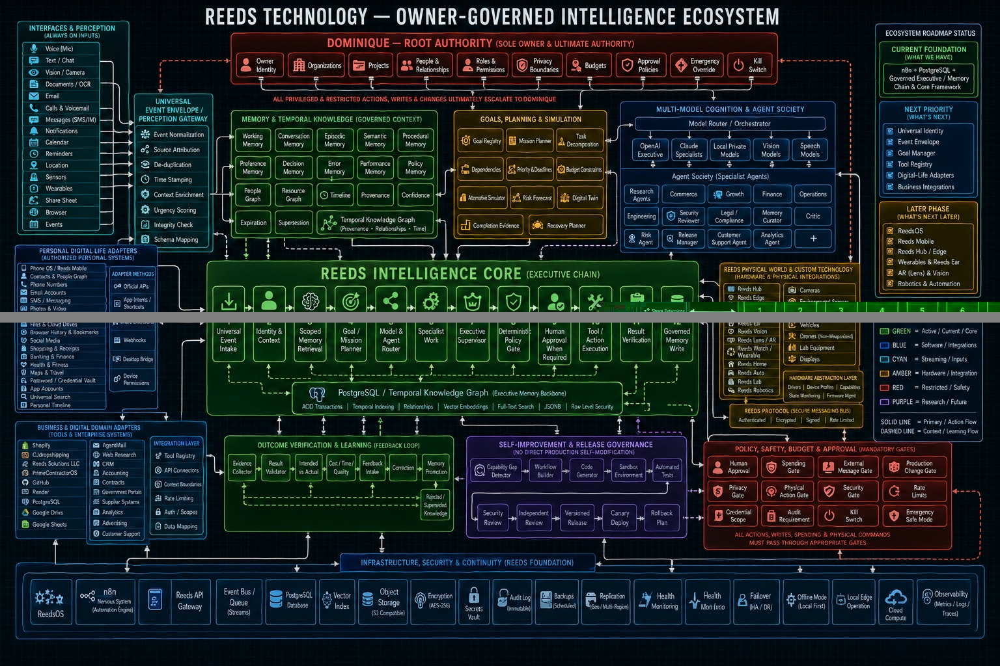

# Reeds Technology — Owner-Governed Intelligence Ecosystem

**Architecture baseline:** Version 1.0  
**Locked:** August 22, 2026  
**Root authority:** Dominique Reed  
**Current implementation repository:** `domogotu/Shopify-automation-v1`

## Purpose

Reeds Technology is the long-term software, intelligence, device, and infrastructure ecosystem that will connect Dominique's authorized digital and physical world. It is designed to preserve Dominique's identity, memory, privacy, and final authority; coordinate specialized intelligence and tools; create new capabilities when existing technology is insufficient; and evolve through verified, reversible, owner-approved development.

Shopify Automation OS is the first operating environment and proof of the governed executive, memory, verification, and approval pattern. Shopify is an adapter to the larger system—not the boundary of the system.

## Locked constitutional principles

These principles are architectural requirements, not suggestions:

1. **Dominique is the sole root authority.** No AI model, specialist agent, workflow, vendor, application, or device may grant itself additional authority.
2. **Owner-governed access only.** The system may connect to Dominique's accounts, applications, devices, communications, media, data, and physical systems only through explicit authorization and revocable scopes.
3. **Context isolation is mandatory.** Personal, business, organization, project, store, customer, device, and sensitive-data boundaries must be enforced before retrieval, reasoning, or action.
4. **Models advise; deterministic policy authorizes.** Model output cannot replace identity checks, permissions, approval records, budgets, tool allowlists, or safety gates.
5. **High-impact actions require the correct gate.** Spending, external communications, production changes, credential changes, physical actions, and sensitive-data access must pass their corresponding policy and approval controls.
6. **Memory must be governed.** Stored knowledge requires provenance, scope, observed time, sensitivity, confidence, status, retention, and supersession handling.
7. **Actions must be verified.** A tool call is not success. The system must compare the intended outcome with independent evidence of the actual outcome.
8. **Self-improvement is proposed, tested, reviewed, versioned, and reversible.** The system must not silently modify production workflows, policies, permissions, or its own governing rules.
9. **Every privileged operation is auditable.** Identity, context, evidence, decision, policy result, approval, action, verification, and memory effects must be traceable.
10. **Emergency control remains human-accessible.** Dominique must retain an independent kill switch, emergency safe mode, credential revocation path, and recovery procedure.
11. **Local continuity matters.** Critical identity, permissions, memory, safety controls, and essential functions should eventually support encrypted local or edge operation when cloud services are unavailable.
12. **Build when integration is insufficient.** Existing products are integrated first when they meet requirements. Reeds software, protocols, and hardware are created when commercial systems cannot provide the required control, privacy, speed, interoperability, or capability.

## Primary executive chain

Every meaningful request, event, goal, or observation follows the governed chain below:

1. Universal Event Intake
2. Identity and Context
3. Scoped Memory Retrieval
4. Goal and Mission Planner
5. Model and Agent Router
6. Specialist Work
7. Executive Supervisor
8. Deterministic Policy Gate
9. Human Approval When Required
10. Tool or Action Execution
11. Result Verification
12. Governed Memory Write

PostgreSQL and the future Temporal Knowledge Graph support retrieval, planning, agent work, supervision, verification, and governed memory. They do not bypass policy or approval gates.

## Complete system domains

### 1. Dominique — root authority

- Owner identity
- Organizations
- Projects
- People and relationships
- Roles and permissions
- Privacy boundaries
- Budgets
- Approval policies
- Emergency override
- Kill switch

All privileged actions, restricted writes, permission changes, production changes, spending, and physical commands ultimately escalate according to policies owned by Dominique.

### 2. Interfaces and perception

- Voice and microphone
- Text and chat
- Vision and cameras
- Documents and OCR
- Email
- Calls and voicemail
- SMS, messaging, and approved communication channels
- Notifications
- Calendar and reminders
- Location
- Sensors and wearables
- Share sheet
- Browser
- Application and system events

Inputs pass through a Universal Event Envelope and Perception Gateway that performs normalization, source attribution, de-duplication, timestamping, context enrichment, urgency scoring, integrity checking, and schema mapping.

### 3. Personal digital-life adapters

- Phone operating system and Reeds Mobile
- Contacts and People Graph
- Phone numbers
- Email accounts
- SMS and messaging
- Photos and videos
- Music and podcasts
- Files and cloud drives
- Browser history and bookmarks
- Social media
- Shopping and receipts
- Banking and finance
- Health and fitness
- Maps and travel
- Password and credential vault
- Application accounts
- Universal search
- Personal timeline

Adapter methods include official APIs, App Intents and Shortcuts, share extensions, webhooks, desktop bridges, account exports, deep links, browser extensions, and device permissions. Platform security boundaries must be respected; no component may claim universal device access that the operating system does not grant.

### 4. Business and digital-domain adapters

- Shopify
- CJdropshipping
- Reeds Solutions LLC
- PrimeContractorOS
- GitHub
- Render
- PostgreSQL
- Google Drive and Google Sheets
- AgentMail and other approved email systems
- Web research
- CRM
- Accounting
- Contracts and government portals
- Supplier systems
- Analytics and advertising
- Customer support

Each adapter declares authentication, scopes, permitted reads and writes, cost, rate limits, risk, approval requirements, verification method, and recovery procedure in the Tool and Capability Registry.

### 5. Memory and temporal knowledge

- Working memory
- Conversation memory
- Episodic memory
- Semantic memory
- Procedural memory
- Preference memory
- Decision memory
- Error memory
- Performance memory
- Policy memory
- People Graph
- Resource Graph
- Timeline
- Provenance
- Confidence
- Expiration
- Supersession
- Temporal Knowledge Graph

Memory must distinguish verified facts, active policy, historical outcomes, unverified claims, recommendations, corrections, and superseded knowledge.

### 6. Goals, planning, and simulation

- Goal Registry
- Mission Planner
- Task decomposition
- Dependencies
- Priority and deadlines
- Budget constraints
- Alternative simulator
- Risk forecast
- Digital twin
- Completion evidence
- Recovery planner

Goals require an owner, scope, priority, status, success criteria, constraints, required approvals, evidence requirements, and next action.

### 7. Multi-model cognition and agent society

- Model Router and Orchestrator
- OpenAI executive models
- Claude specialists
- Local private models
- Vision models
- Speech models
- Research agents
- Commerce agents
- Growth agents
- Finance agents
- Operations agents
- Engineering agents
- Security reviewer
- Legal and compliance reviewer
- Memory curator
- Critic
- Risk agent
- Release manager
- Customer support agent
- Analytics agent

Specialists receive minimum necessary context and tools. They provide evidence and recommendations; they do not inherit Dominique's authority.

### 8. Tool and capability intelligence

Every tool, application, account, workflow, API, model, device, and physical adapter is registered with:

- Identity and owner
- Purpose and capabilities
- Input and output contracts
- Authentication method
- Permission scopes
- Read/write/physical-action classification
- Data sensitivity
- Cost and rate limits
- Risk level
- Approval requirements
- Verification method
- Failure and recovery behavior
- Current health and version

### 9. Reeds physical world and custom technology

- Reeds Hub
- Reeds Edge
- Reeds Mesh
- Reeds Mobile
- Reeds Ear
- Reeds Vision
- Reeds Lens and AR
- Reeds Watch and wearables
- Reeds Home
- Reeds Auto
- Reeds Lab
- Reeds Robotics
- Cameras and environmental sensors
- Smart-home systems
- Vehicles
- Non-weaponized drones
- Lab equipment
- Displays

The Hardware Abstraction Layer separates intelligence from device-specific drivers. Reeds Protocol provides authenticated, encrypted, signed, rate-limited messaging with device identity, capability declarations, telemetry, command authorization, acknowledgement, and safe-state behavior.

### 10. Policy, safety, budget, and approval

- Human approval
- Spending gate
- External message gate
- Production change gate
- Privacy gate
- Physical action gate
- Security gate
- Rate limits
- Credential scope
- Audit requirement
- Kill switch
- Emergency safe mode

All external writes, spending, production changes, credential operations, and physical commands must pass the appropriate mandatory gates.

### 11. Outcome verification and learning

- Evidence collector
- Result validator
- Intended-versus-actual comparison
- Cost, time, and quality measurement
- Feedback intake
- Correction handling
- Learning candidate generation
- Memory promotion
- Rejected and superseded knowledge

Learning candidates become trusted knowledge only after policy-defined review. A single outcome must not silently rewrite policy or procedure.

### 12. Self-improvement and release governance

- Capability-gap detector
- Workflow builder
- Code generator
- Sandbox environment
- Automated tests
- Security review
- Independent review
- Versioned release
- Canary deployment
- Rollback plan

There is no direct production self-modification path. Every change flows through testing, evidence, review, approval, deployment controls, monitoring, and rollback readiness.

### 13. Infrastructure, security, and continuity

- ReedsOS
- n8n nervous system and automation engine
- Reeds API Gateway
- Event bus and durable queues
- PostgreSQL
- Vector index
- Object storage
- Encryption
- Secrets vault
- Immutable audit log
- Backups
- Replication
- Health monitoring
- Failover and disaster recovery
- Offline mode
- Local edge operation
- Cloud compute
- Observability: metrics, logs, traces, and alerts

## Status classification

| Status | Meaning | Examples |
|---|---|---|
| Current foundation | Implemented or demonstrated now | n8n, PostgreSQL, governed executive chain, scoped memory retrieval, governed memory write, deterministic decision gate |
| Next priority | Near-term software foundation | Universal identity, event envelope, goal manager, tool registry, digital-life adapters, business integrations |
| Later phase | Requires larger software, integration, or hardware program | ReedsOS, Reeds Mobile, Reeds Hub/Edge/Mesh, wearables, AR, vehicles, lab control, robotics |
| Future research | Technically uncertain or dependent on future capabilities | Advanced embodied autonomy, novel interfaces, high-fidelity digital twins, new Reeds hardware platforms |
| Restricted | Never autonomous or requires exceptional controls | Unauthorized access, weapons, surveillance without consent, unreviewed self-propagation, bypassing legal or safety controls |

## Build strategy

1. **Integrate existing technology** when it satisfies control, security, performance, and interoperability requirements.
2. **Add a Reeds control layer** when vendor products need unified identity, memory, policy, orchestration, and verification.
3. **Build Reeds software or hardware** when commercial systems cannot meet the required capability, privacy, speed, offline operation, or owner control.

## Roadmap

### Current foundation

- n8n orchestration
- PostgreSQL durable state and memory
- Governed executive and supervisor workflow
- Scoped memory retrieval
- Deterministic policy gate
- Governed memory write
- Result and integration validation foundations

### Phase 1 — Universal core

- Replace store-only identity assumptions with owner, organization, workspace, domain, resource, actor, and device identities
- Define the Universal Event Envelope
- Build universal context assembly
- Establish the Tool and Capability Registry
- Formalize root authority and approval policy
- Maintain Shopify as the first domain adapter

### Phase 2 — Goals and trusted learning

- Goal and Task Manager
- Mission Planner and decomposition
- Outcome and Feedback Evaluator
- Learning Review and Memory Promotion
- Executive Context Builder
- Temporal relationships and decision provenance

### Phase 3 — Digital-life integration

- Reeds Mobile gateway
- Contacts and People Graph
- Email, messaging, calendar, reminders, files, photos, media, browser, location, finance, and health adapters
- Universal search and personal timeline
- Desktop bridge and secure credential vault
- Fast event synchronization and local cache

### Phase 4 — Reeds platform

- ReedsOS service layer
- Reeds API Gateway and event bus
- Local/private model routing
- Reeds Hub, Edge, and Mesh
- Offline operation, failover, and continuity
- Reeds Developer Platform and Reeds Protocol SDK

### Phase 5 — Physical intelligence

- Reeds Ear, Vision, Lens, Watch, Home, Auto, Lab, and Robotics
- Hardware abstraction and device capability registry
- Safety-certified physical-action gates
- Simulation, digital twins, and evidence-based autonomy

## Repository role

This repository remains the active Shopify Automation OS implementation and the first operational adapter for Reeds Technology. The universal intelligence core should eventually be separated into its own repository so commerce-specific schemas and workflows do not define the identity model of the entire ecosystem. Until then, this document is the controlling master architecture reference for all expansion work performed here.

## Change control

Material changes to root authority, privacy boundaries, approval requirements, safety controls, memory governance, or production self-modification rules require:

1. A written change proposal
2. Impact and risk analysis
3. Updated diagram and specification
4. Test evidence
5. Dominique's explicit approval
6. Versioned repository commit
7. Rollback plan

