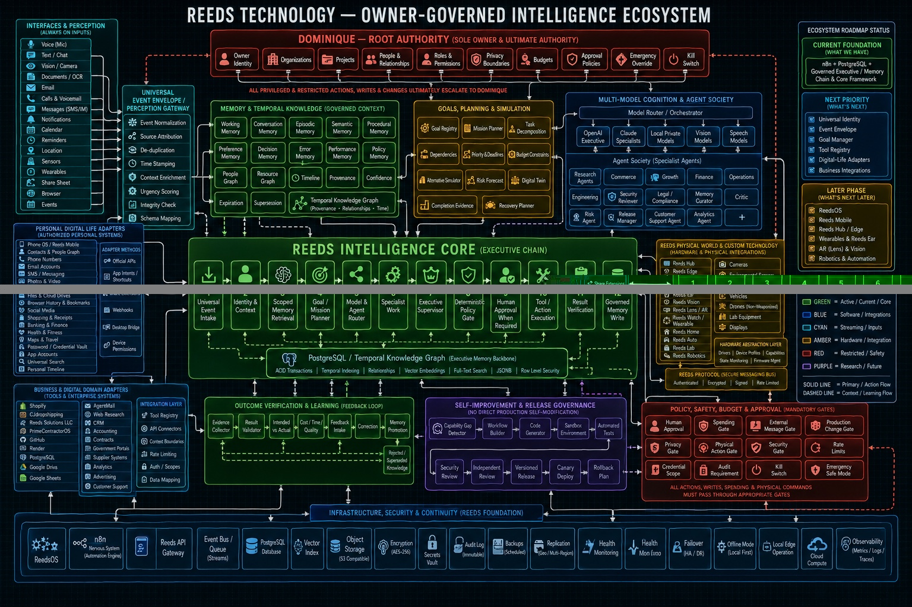

# Reeds Technology Owner-Governed Intelligence Ecosystem
\n

## Production Architecture Blueprint

**Owner and ultimate authority:** Dominique Reed  
**Organization:** Reeds Solutions LLC  
**Architecture status date:** August 25, 2026  
**Purpose:** Convert the supplied ecosystem diagram into a buildable, secure, owner-governed system.

---

## 1. What This System Actually Is

The diagram represents a **governed intelligence and automation platform**, not one AI model and not one n8n workflow. It joins five different kinds of systems:

1. **Inputs and adapters** receive events from websites, email, files, business systems, devices, and people.
2. **The Reeds Intelligence Core** converts every event into a governed task and controls its complete lifecycle.
3. **Models and specialist agents** analyze, plan, draft, classify, and recommend.
4. **Deterministic gates and Dominique approvals** decide whether an action is allowed.
5. **Tools and infrastructure** execute allowed actions, verify results, preserve evidence, and update memory.

The system must maintain a hard distinction between:

- **Thinking:** models may analyze, simulate, propose, rank, and draft.
- **Deciding:** deterministic policy plus Dominique decide whether a sensitive action is allowed.
- **Acting:** a narrowly scoped tool performs only the approved operation.
- **Verifying:** an independent step confirms what actually happened.
- **Remembering:** only validated facts and governed summaries enter long-term memory.

No model is Dominique. No model receives root authority. “Dominique — Root Authority” means every ownership rule, restricted operation, override, and emergency action ultimately resolves to an authenticated owner record controlled by Dominique.

---

## 2. Three Operational Planes

The picture becomes easier to build when divided into three planes.

### 2.1 Data Plane

Carries events, documents, messages, API results, model outputs, tool results, and evidence.

Components:

- Website forms, email, chat, files, Google Sheets, APIs, cameras, and future devices
- Universal Event Envelope
- n8n workflows and workers
- PostgreSQL records
- Object storage documents
- Queue messages
- Model requests and responses

### 2.2 Control Plane

Determines identity, permissions, policy, budgets, approvals, tool scope, retries, and release state.

Components:

- Owner identity and delegated roles
- Policy registry
- Approval service
- Tool registry
- Credential references
- Budget and rate-limit controls
- Emergency stop and kill switch
- Release governance

### 2.3 Evidence Plane

Makes the system auditable and recoverable.

Components:

- Append-only audit events
- Execution traces
- Approval records
- Tool receipts
- Input/output hashes
- Versioned files
- Backups and restore tests
- Outcome evaluations and correction records

The data plane cannot bypass the control plane. The control plane cannot silently erase the evidence plane.

---

## 3. Actual Technology Assignment

| Diagram responsibility | Production component | Why it belongs there |
|---|---|---|
| Public forms and webhook inputs | Reeds website plus n8n Webhook nodes | Existing working entry point; n8n can receive and orchestrate events. |
| Universal event normalization | Reeds API Gateway service, initially an n8n Code node | A single canonical schema prevents each workflow from inventing its own payload. Move to a small TypeScript API when traffic and reuse justify it. |
| Workflow orchestration | Self-hosted n8n on Render | Existing automation engine; handles triggers, branching, waits, retries, connectors, and schedules. |
| Durable system of record | Managed PostgreSQL | Stores identities, events, tasks, approvals, policies, memory metadata, evidence, and audit records transactionally. |
| Semantic retrieval | `pgvector` in PostgreSQL | Keeps embeddings beside governed records and authorization metadata instead of creating an ungoverned second memory store. |
| Full-text and structured search | PostgreSQL full-text search plus indexed JSONB | Supports exact filters, keyword search, and flexible event metadata. |
| Queue and short-lived cache | Render Key Value, compatible with Redis/Valkey | Supports n8n queue mode, locks, idempotency keys, throttles, and ephemeral state. Render describes Key Value as suitable for caches and job queues. |
| Large files and immutable evidence | S3-compatible object storage with versioning; Object Lock for selected evidence | Databases should store file metadata and hashes, not large binary files. Object Lock can provide write-once-read-many protection. |
| Models | OpenAI as primary; Claude as optional second provider; local models only for approved low-risk use | A router selects models by task, sensitivity, quality, latency, and budget. Models never receive direct unrestricted tools. |
| Agent runtime | Start inside n8n; graduate reusable agent logic to a versioned TypeScript service using an agent SDK | n8n is appropriate for current workflows. A service becomes useful when agents, approvals, and resumable state are shared across many workflows. |
| Human approval | PostgreSQL approval record plus signed approval link or authenticated owner console; n8n waits for resolution | Approval must be durable, attributable, scoped, expiring, and independent of the model’s wording. |
| Credentials | n8n Credentials and Render environment variables; human recovery copy in an owner-controlled password manager | Secrets must never enter prompts, Sheets, workflow exports, logs, or source control. |
| Audit | Append-only PostgreSQL audit table plus immutable evidence exports | Every read, decision, approval, tool call, and verification must have an actor, timestamp, reason, and correlation ID. |
| Observability | Structured logs, metrics, traces, health checks, and alerts | Distinguishes model errors, policy rejections, connector failures, queue delays, and data problems. |
| Deployment | GitHub source control and Render staging/production services | Supports reviewed releases, environment separation, rollback, and controlled secrets. |
| Future physical devices | Separate device gateway using signed device identities and the Reeds Protocol | Physical actions require stronger isolation and may never connect directly to a model. |

### Required correction to the diagram

“Secrets Vault” cannot mean a memory table that agents can search. It must mean a dedicated secret storage boundary. Agents receive only a **credential reference** such as `credential_ref=gmail_smtp_production`, and the authorized tool resolves that reference at execution time.

---

## 4. Canonical End-to-End Flow

```mermaid
flowchart LR
  A[Interface or Business System] --> B[Universal Event Gateway]
  B --> C[Identity and Context]
  C --> D[Scoped Memory Retrieval]
  D --> E[Goal and Mission Planner]
  E --> F[Model Router and Specialist Agents]
  F --> G[Executive Supervisor]
  G --> H[Deterministic Policy Gate]
  H -->|Allowed without approval| J[Scoped Tool Execution]
  H -->|Dominique approval required| I[Durable Approval Record]
  I -->|Approved and unexpired| J
  I -->|Rejected or expired| X[Stop and Report]
  J --> K[Independent Result Verification]
  K -->|Verified| L[Governed Memory and Audit Write]
  K -->|Failed or uncertain| M[Correction or Recovery Plan]
  M --> H
  L --> N[Outcome Feedback and Performance Learning]
```



Every production request receives one `correlation_id`. That ID follows it through event intake, model calls, approval, execution, verification, audit, files, and memory.

---

## 5. Universal Event Envelope

Every input is converted into the same envelope before any model sees it.

```json
{
  "event_id": "evt_uuid",
  "correlation_id": "corr_uuid",
  "causation_id": null,
  "event_type": "customer.intake.submitted",
  "schema_version": "1.0",
  "occurred_at": "2026-08-25T20:00:00Z",
  "received_at": "2026-08-25T20:00:01Z",
  "source": {
    "system": "reedssolutionsllc.org",
    "channel": "web_form",
    "adapter": "website_intake_v1"
  },
  "actor": {
    "actor_type": "external_customer",
    "actor_id": "customer_uuid",
    "authenticated": false
  },
  "owner_scope": {
    "owner_id": "dominique_root_owner",
    "organization_id": "reeds_solutions_llc",
    "project_id": "service_intake"
  },
  "classification": {
    "sensitivity": "business_confidential",
    "contains_pii": true,
    "contains_secret": false,
    "retention_class": "customer_intake"
  },
  "integrity": {
    "idempotency_key": "source_submission_id",
    "content_hash": "sha256",
    "signature_verified": false
  },
  "payload": {},
  "attachments": [],
  "requested_capability": "intake_review"
}
```

### Gateway responsibilities

1. Verify signature or authentication when available.
2. Reject payloads larger than configured limits.
3. Scan for malware and prohibited data types before document processing.
4. Normalize dates, phone numbers, addresses, identifiers, and source names.
5. Detect duplicate events with an idempotency key.
6. Classify sensitivity and flag suspected credentials.
7. Preserve the original input hash and source attribution.
8. Map the event to an allowed capability, never directly to a powerful tool.

External text is always untrusted data, even when it contains instructions that look like system commands.

---

## 6. The Twelve-Step Reeds Intelligence Core

### Step 1 — Universal Event Intake

**Input:** Raw webhook, message, file, API event, schedule, or device event.  
**Work:** Validate transport, normalize schema, assign IDs, classify sensitivity, detect duplication.  
**Output:** Accepted canonical event or a structured rejection.  
**Stored in:** `events`, `event_payload_refs`, `audit_events`.  
**Why:** All later components need one reliable contract.

### Step 2 — Identity and Context

**Input:** Canonical event.  
**Work:** Resolve the actor, owner, organization, project, role, permissions, consent, location, and applicable policy set.  
**Output:** `execution_context` containing verified identity claims and scopes.  
**Stored in:** `identities`, `organizations`, `memberships`, `roles`, `permissions`, `projects`, `sessions`.  
**Failure rule:** Unknown identity receives minimum access; it never inherits Dominique’s authority.

### Step 3 — Scoped Memory Retrieval

**Input:** Event plus execution context.  
**Work:** Retrieve only relevant, permitted, current records; rank by exact match, relationship, recency, confidence, and semantic relevance.  
**Output:** A context package with citations to source records.  
**Stored in:** `memories`, `memory_versions`, `entities`, `relationships`, `embeddings`, `source_records`.  
**Failure rule:** Missing evidence is reported as unknown; the model may not invent it.

### Step 4 — Goal and Mission Planner

**Input:** Request and governed context.  
**Work:** Define the goal, success criteria, subtasks, dependencies, deadline, budget, risks, and stop conditions.  
**Output:** A versioned `mission_plan`.  
**Stored in:** `goals`, `missions`, `tasks`, `dependencies`, `budgets`, `risk_items`.  
**Why:** A model should not improvise an unrestricted chain of actions.

### Step 5 — Model and Agent Router

**Input:** Individual planned task.  
**Work:** Select the smallest capable model or deterministic function based on sensitivity, modality, quality, latency, provider availability, and budget.  
**Output:** A provider-neutral model request and expected structured schema.  
**Stored in:** `model_runs`, `model_usage`, `routing_decisions`.  
**Rule:** Sensitive records are minimized before provider calls; secrets are never included.

### Step 6 — Specialist Agent

**Input:** One scoped task, permitted tools, approved context, and output schema.  
**Work:** Research, classify, calculate, draft, inspect, or recommend within its specialty.  
**Output:** Structured proposal with evidence, assumptions, confidence, and requested tools.  
**Examples:** Research, finance, operations, engineering, legal/compliance support, security review, memory curator, customer support.  
**Rule:** An agent receives only tools needed for its task.

### Step 7 — Executive Supervisor

**Input:** Specialist proposals.  
**Work:** Detect conflicts, missing evidence, duplicate tasks, unsupported conclusions, scope expansion, and policy-sensitive actions.  
**Output:** Accepted proposal, correction request, escalation, or cancellation recommendation.  
**Important:** The supervisor is still an AI reviewer. It cannot replace deterministic gates.

### Step 8 — Deterministic Policy Gate

**Input:** Proposed action with typed parameters.  
**Work:** Evaluate fixed rules for identity, permission, sensitivity, spending, destination, production impact, physical impact, credential scope, rate limits, and required approvals.  
**Output:** `allow`, `deny`, or `require_approval`, with policy IDs and reasons.  
**Stored in:** `policy_decisions`.  
**Why:** Prompts are not security controls. Policy decisions must be reproducible without a model.

### Step 9 — Human Approval When Required

**Input:** Exact proposed action and policy decision.  
**Work:** Present Dominique with who/what/where/why, exact side effects, cost, destination, affected records, rollback plan, and expiration.  
**Output:** Signed approval, rejection, or expiration.  
**Stored in:** `approval_requests`, `approval_decisions`.  
**Rule:** Approval is bound to an action hash. Changing tool parameters invalidates approval.

### Step 10 — Tool or Action Execution

**Input:** Allowed action plus approval proof when required.  
**Work:** Resolve credential reference, enforce tool-specific schema, execute with idempotency and timeout, capture provider receipt.  
**Output:** Typed tool result.  
**Stored in:** `tool_executions`, `external_receipts`.  
**Rule:** A model never receives a raw database connection, shell, email account, payment API, or production deployment credential.

### Step 11 — Result Verification

**Input:** Intended outcome and actual tool result.  
**Work:** Independently confirm state through a read-back, checksum, provider status, database query, email acceptance receipt, or human inspection.  
**Output:** `verified`, `failed`, `partial`, or `uncertain`.  
**Stored in:** `verification_results`, `evidence_items`.  
**Rule:** An HTTP 200 alone is not proof that the business outcome occurred.

### Step 12 — Governed Memory Write

**Input:** Verified result, evidence, and retention policy.  
**Work:** Separate facts from summaries and preferences; attach provenance, confidence, owner scope, sensitivity, validity dates, and supersession links.  
**Output:** New memory version or a rejected-memory record.  
**Stored in:** `memories`, `memory_versions`, `audit_events`.  
**Rule:** Model output does not become fact until verified or explicitly labeled as an unverified hypothesis.

---

## 7. Memory and Temporal Knowledge

### Memory classes

| Memory class | Contents | Typical retention | Write condition |
|---|---|---|---|
| Working | Current execution variables | Hours to days | Automatic; execution-scoped |
| Conversation | User interaction history and summaries | Policy-defined | Stored after sensitivity review |
| Episodic | What happened in a completed event | Long-term | Requires outcome and provenance |
| Semantic | Stable facts about organizations, people, products, and rules | Until superseded | Verified source required |
| Procedural | Approved SOPs, workflows, tool instructions | Versioned | Reviewed release required |
| Preference | Dominique’s explicit choices | Until changed | Owner-authenticated instruction |
| Decision | Approved decisions and rationale | Long-term | Decision authority recorded |
| Error | Failures, causes, and corrections | Long-term operational | Verification evidence required |
| Performance | Cost, latency, quality, reliability | Aggregated | Automatically measured |
| Policy | Versioned deterministic rules | Indefinite | Controlled release only |

### Required fields for every durable memory

- `memory_id`
- `memory_type`
- `owner_id`, `organization_id`, and optional `project_id`
- `subject_entity_id`
- `fact_or_claim`
- `source_id` and source location
- `provenance_chain`
- `confidence`
- `sensitivity`
- `valid_from`, `valid_to`
- `supersedes_memory_id`
- `verification_status`
- `created_by_actor_id`
- `created_by_run_id`
- `retention_policy_id`

Deletion is normally a tombstone or supersession event so history remains auditable. Privacy-driven deletion follows a separate controlled procedure.

---

## 8. Multi-Model Cognition and Agent Society

### Model router decision order

1. Can deterministic code perform the task reliably? If yes, do not use a model.
2. Is the data allowed to leave the Reeds environment?
3. What modality is required: text, vision, speech, document, or code?
4. What accuracy and reasoning level is required?
5. What is the maximum cost and latency?
6. Is the provider healthy and below rate limits?
7. Does the task require a second-model review?

### Agent contract

Every specialist agent must define:

- Purpose and prohibited actions
- Accepted input schema
- Output schema
- Allowed data classifications
- Allowed tools and exact operations
- Maximum model/tool budget
- Timeout and retry limits
- Approval categories
- Required evidence
- Confidence and escalation rules
- Prompt/instruction version
- Evaluation suite and release version

### Recommended initial agents

Build only agents with current business value:

1. Intake and classification agent
2. Missing-information agent
3. Internal planning agent
4. Security and credential-governance agent
5. Research agent
6. Finance and quote-support agent
7. Operations agent
8. Compliance-support agent
9. Customer-draft agent, always pending Dominique approval
10. Memory curator
11. Critic and verification agent

“Legal/compliance agent” must be labeled support, not a lawyer, and must escalate high-stakes conclusions for qualified human review.

---

## 9. Deterministic Policy and Approval Gates

### Action classes

| Class | Examples | Default handling |
|---|---|---|
| Read-only low sensitivity | Read approved public data, calculate, classify | Auto-allow with audit |
| Internal reversible write | Update internal task status, append governed metadata | Allow only with scoped role and verification |
| External communication | Send email, message, post, submit form | Dominique approval required unless a narrowly preapproved template and recipient rule exists |
| Spending or financial commitment | Purchase, subscription, transfer, quote acceptance | Dominique approval always required |
| Credential or permission change | Create, rotate, reveal, revoke, share, change role | Dominique approval plus step-up authentication |
| Production change | Deploy, publish workflow, alter database schema | Reviewed release and Dominique approval |
| Destructive action | Delete records, cancel service, overwrite evidence | Dominique approval; backup and rollback required |
| Physical action | Unlock, move, activate device, operate vehicle/robot | Separate physical safety gate and authenticated local controller |
| Emergency action | Kill switch, disable integrations, revoke access | Dominique or tightly defined automatic containment policy |

### Approval display must include

- Human-readable description
- Exact structured tool parameters
- Credential reference, never credential value
- Recipient or external destination
- Expected cost and limit
- Records and systems affected
- Whether the action is reversible
- Verification method
- Rollback method
- Requesting agent and originating event
- Expiration time
- Cryptographic action hash

This prevents “approve this harmless step” dialogs from concealing a different operation.

---

## 10. Tool Registry and Integration Layer

Every tool is registered separately from the model.

```json
{
  "tool_id": "gmail.send_internal_report.v1",
  "owner_scope": "reeds_solutions_llc",
  "allowed_agents": ["intake_reporter", "credential_governance"],
  "allowed_operations": ["send"],
  "credential_ref": "gmail_smtp_production",
  "recipient_policy": "dominique_only",
  "data_policy": "no_secrets",
  "requires_approval": false,
  "rate_limit": "20/hour",
  "timeout_seconds": 30,
  "verification": "smtp_acceptance_and_message_id",
  "enabled": true
}
```

### Adapter pattern

Each business system adapter has four boundaries:

1. **Authentication adapter:** OAuth, service account, API key reference, or signed webhook.
2. **Data mapper:** External fields to canonical Reeds schema.
3. **Capability wrapper:** Exposes only approved operations, not the entire provider API.
4. **Receipt verifier:** Reads back or validates the result.

This pattern applies to Shopify, CJdropshipping, GitHub, Render, Google Drive, Google Sheets, CRM, accounting, advertising, government portals, supplier systems, and future customer-support systems.

---

## 11. PostgreSQL Core Schema

### Identity and authority

- `owners`
- `identities`
- `organizations`
- `projects`
- `memberships`
- `roles`
- `permissions`
- `delegations`
- `sessions`

### Events and execution

- `events`
- `event_payload_refs`
- `runs`
- `tasks`
- `task_dependencies`
- `idempotency_keys`
- `model_runs`
- `tool_executions`
- `verification_results`

### Governance

- `policies`
- `policy_versions`
- `policy_decisions`
- `approval_requests`
- `approval_decisions`
- `budgets`
- `rate_limit_rules`
- `credential_references`
- `release_records`

### Memory and knowledge

- `entities`
- `relationships`
- `memories`
- `memory_versions`
- `embeddings`
- `source_records`
- `timelines`

### Evidence and operations

- `audit_events`
- `evidence_items`
- `external_receipts`
- `incidents`
- `health_checks`
- `performance_metrics`
- `backup_records`
- `restore_tests`

All owner-scoped tables include `owner_id`; business data also includes `organization_id`; project data includes `project_id`. PostgreSQL Row-Level Security is enabled with default-deny policies. PostgreSQL documentation notes that when RLS is enabled without an applicable policy, access defaults to denial. Application roles must not be table owners or have `BYPASSRLS`.

### Current database security issue to address

The current deployment log reports PostgreSQL 16. Keep it patched to at least a fixed security release. PostgreSQL published a 2026 row-security policy-cache vulnerability affecting versions before 16.15, among other branches. Confirm the exact Render minor version before relying on RLS for production isolation.

---

## 12. Outcome Verification and Learning

The feedback loop is evidence-based, not autonomous prompt rewriting.

### Per-run measures

- Goal completed or not
- Required fields present
- Output schema valid
- Evidence coverage
- Human correction count
- External action verified
- Latency
- Model tokens and cost
- Tool cost
- Retry count
- Policy denials
- Security incidents

### Learning outputs

- Proposed prompt correction
- Proposed tool-schema correction
- Proposed routing correction
- New regression test
- Updated risk rule
- Memory correction or supersession

No learning output directly edits a production prompt, policy, workflow, schema, or tool. It becomes a versioned change proposal.

---

## 13. Self-Improvement and Release Governance

The purple section is a controlled software-development pipeline:

1. Capability-gap detector creates an issue with evidence.
2. Workflow builder or code generator creates a branch or draft artifact.
3. Static validation checks syntax, schemas, secrets, and prohibited metadata.
4. Sandbox tests run without production credentials.
5. Automated evaluations compare against a fixed test set.
6. Security review checks tool scope, data exposure, prompt injection, and rollback.
7. Independent review confirms behavior and business fit.
8. Dominique approves the exact version.
9. Canary deployment receives limited traffic.
10. Health and quality checks decide continue or roll back.
11. Versioned release is recorded with artifact hashes.

The system may **propose** its own improvement. It may not merge, publish, deploy, grant permissions, or rewrite a policy by itself.

---

## 14. Infrastructure and Continuity

### Current minimum production foundation

- Render web service running n8n
- Managed PostgreSQL
- Stable `N8N_ENCRYPTION_KEY`
- n8n Credentials and Render environment secrets
- GitHub version control for workflow JSON and infrastructure files
- Scheduled workflow/database exports
- Health endpoint and external uptime check
- Structured logs with secret redaction

### Scale-out foundation

- Render Key Value/Valkey
- n8n `EXECUTIONS_MODE=queue`
- One n8n main process
- One or more n8n workers
- Optional dedicated webhook processors
- Same PostgreSQL database and encryption key available to authorized n8n processes
- S3-compatible binary storage

n8n’s queue architecture uses Redis-compatible messaging while PostgreSQL persists execution information; worker and webhook processes need access to both. All n8n processes that decrypt credentials must use the same encryption key.

### Backup policy

- Daily database backup
- Weekly restorable workflow export
- Versioned object storage
- Monthly documented restore test during foundation stage
- Quarterly recovery exercise after stabilization
- Separate encrypted owner recovery package containing provider/account inventory, never mixed into AI memory

Backups are not proven until a restore test succeeds.

### Observability

Collect:

- Correlated logs by `correlation_id`
- Workflow and tool latency
- Queue depth and oldest-job age
- Worker health
- Database connections and storage
- Model errors, costs, and rate limits
- Policy denials and approval age
- Verification failure rate
- Backup and restore status

Alert Dominique for critical failures, credential/recovery risks, repeated policy violations, unexpected spending, verification failures, and emergency containment actions.

---

## 15. Physical World and Reeds Protocol

This remains a later phase.

The physical integration diagram should be implemented through a separate device-control boundary:

```text
Agent proposal
  -> deterministic physical policy
  -> Dominique approval where required
  -> signed command with nonce and expiry
  -> device gateway
  -> locally enforced safety interlock
  -> device
  -> sensor-confirmed receipt and result
```

Required Reeds Protocol message fields:

- Device identity and certificate
- Command ID and correlation ID
- Command type and typed parameters
- Issuer identity
- Policy decision ID
- Approval ID when required
- Issued time and expiration
- Nonce and sequence number
- Signature
- Maximum power, duration, speed, or movement limits
- Required local preconditions
- Emergency-stop behavior
- Acknowledgment and result signature

Cloud AI must never be the final safety controller for a lock, vehicle, drone, robot, power system, or hazardous actuator.

---

## 16. Complete Example: Reeds Customer Intake

1. A customer submits the website form.
2. The website sends a POST request to the production n8n webhook.
3. The gateway creates a canonical event and rejects duplicates.
4. Identity/context marks the sender as an external customer and Dominique as owner.
5. Scoped memory retrieves Reeds services, intake rules, prior customer records if permitted, and current approval policies.
6. The planner creates tasks: normalize, classify, identify missing information, assess risk, draft internal plan, estimate quote range, update tracker, and prepare a customer-safe draft.
7. The router sends only necessary sanitized data to the selected model.
8. Specialist agents return structured JSON with evidence, assumptions, confidence, and blocked actions.
9. The supervisor checks consistency and makes sure the internal plan is not exposed to the customer.
10. The policy gate allows an internal Sheet append and Dominique-only email but blocks customer email without approval.
11. The Sheet tool appends the intake row and reads it back.
12. Gmail sends the internal report to Dominique and returns an SMTP acceptance receipt and message ID.
13. The webhook sends a fixed thank-you response to the customer.
14. Verification confirms the Sheet row, email acceptance, and webhook response.
15. The system writes a governed episodic memory and audit events.
16. Any customer-facing draft remains pending Dominique approval.

The existing intake implementation already demonstrates part of this flow. The next correction is to make its event, policy, evidence, and memory records explicit rather than leaving them implicit inside one workflow execution.

---

## 17. Build Phases

### Phase 0 — Stabilize and inventory

- Verify current Render commit, n8n version, PostgreSQL minor version, backups, encryption key, credentials, and ownership.
- Export all current workflows.
- Complete the Credential Governance Register.
- Separate staging and production.
- Define incident and emergency-stop procedures.

**Exit test:** A fresh environment can be restored without guessing credentials, owners, or workflow versions.

### Phase 1 — Core contracts

- Universal identity IDs
- Universal Event Envelope v1
- Correlation and idempotency
- Audit-event schema
- Tool registry
- Policy registry
- Approval records
- Evidence and verification records

**Exit test:** One intake request can be traced from source through every decision and result.

### Phase 2 — Governed memory

- Memory tables and provenance
- Temporal validity and supersession
- Exact and full-text retrieval
- `pgvector` semantic retrieval
- Memory curator
- Retention and deletion policies

**Exit test:** Every retrieved claim identifies its source, owner scope, confidence, and validity.

### Phase 3 — Planning and agent runtime

- Goal/mission/task records
- Model router
- Initial specialist agents
- Executive supervisor
- Structured output schemas
- Budget and rate limits

**Exit test:** Agent plans are reproducible, bounded, and cannot directly invoke unregistered tools.

### Phase 4 — Deterministic governance

- Policy engine
- Signed and expiring approvals
- Tool-level guardrails
- Production/spending/external-message/credential gates
- Read-back verification

**Exit test:** Red-team tests cannot bypass approval by prompt injection, parameter changes, retries, or alternate routes.

### Phase 5 — Scale and resilience

- Render Key Value
- n8n queue mode and workers
- Object storage
- Observability dashboards
- Alerts
- Restore drills
- Failover and degraded mode

**Exit test:** A worker or provider failure does not lose events or duplicate irreversible actions.

### Phase 6 — Controlled improvement

- Evaluation suites
- Capability-gap issues
- Generated change branches
- Sandbox tests
- Security review
- Canary and rollback

**Exit test:** No generated change reaches production without review, evidence, and Dominique approval.

### Phase 7 — Future interfaces and physical systems

- Mobile application
- Voice and vision interfaces
- Local/private models
- Reeds Protocol
- Device gateway and safety controller
- Wearables, AR, robotics, and other hardware only when justified

---

## 18. What Must Not Be Built Yet

- A custom “ReedsOS” kernel or operating system
- Autonomous production code deployment
- Autonomous credential rotation or permission administration
- A model with direct database-owner access
- A shared all-powerful tool account
- Automatic external messaging without a narrow preapproval policy
- Physical device control directly from cloud model output
- Multi-region replication before restore testing and basic monitoring work
- Local models merely for appearance; deploy them only for privacy, latency, offline, or cost requirements
- A second memory database before PostgreSQL governance is complete

These ideas remain valid roadmap possibilities, but implementing them before identity, events, policy, approvals, evidence, and recovery would increase risk without completing the intelligence core.

---

## 19. Definition of Correctly Built

The ecosystem is correctly built only when all of the following are true:

- Every input becomes a versioned canonical event.
- Every run has an owner, organization, purpose, correlation ID, and budget.
- Every retrieval is permission-scoped and provenance-backed.
- Every agent has a limited role and limited tools.
- Every tool call passes a deterministic policy gate.
- Every sensitive action is bound to a durable Dominique approval.
- Every external effect has a receipt and independent verification.
- Every durable memory is classified, sourced, versioned, and correctable.
- Every production artifact is versioned and recoverable.
- Every credential is referenced, never exposed to the model.
- Every failure can stop safely without losing the original event.
- The kill switch can disable tool execution while preserving read-only diagnostics and evidence.

---

## 20. Immediate Build Order for Reeds

Do these next, in order:

1. Finish credential and owner recovery verification.
2. Confirm PostgreSQL minor version and backup/restore capability.
3. Export and version every live n8n workflow.
4. Create the Universal Event Envelope and canonical IDs.
5. Add event, run, policy-decision, approval, tool-execution, verification, and audit tables.
6. Refactor the working intake flow onto those contracts.
7. Add deterministic external-message, credential, spending, and production gates.
8. Add governed memory with provenance and temporal supersession.
9. Add reusable model routing and specialist-agent contracts.
10. Add queue mode and workers only after the contracts are stable.

This order turns the existing working intake automation into the first production slice of the larger Reeds ecosystem instead of starting over.

---

## 21. Authoritative Technical References

- [n8n queue-mode architecture](https://github.com/n8n-io/n8n-docs/blob/main/docs/deploy/host-n8n/configure-n8n/scaling/enable-queue-mode.md)
- [Render environment variables and secrets](https://render.com/docs/configure-environment-variables)
- [Render Key Value](https://render.com/docs/key-value)
- [PostgreSQL Row-Level Security](https://www.postgresql.org/docs/17/ddl-rowsecurity.html)
- [PostgreSQL security notice for RLS policy caching](https://www.postgresql.org/support/security/CVE-2026-14666/)
- [OpenAI Agents SDK](https://openai.github.io/openai-agents-js/)
- [OpenAI human-in-the-loop approvals](https://openai.github.io/openai-agents-js/guides/human-in-the-loop/)
- [OpenAI agent guardrails](https://openai.github.io/openai-agents-js/guides/guardrails/)
- [OpenAI agent tracing](https://openai.github.io/openai-agents-js/guides/tracing/)
- [NIST AI Risk Management Framework Playbook](https://www.nist.gov/itl/ai-risk-management-framework/nist-ai-rmf-playbook)
- [OWASP agent data-access guidance](https://cornucopia.owasp.org/cards/AAI6)
- [OWASP context isolation and least-privilege guidance](https://cornucopia.owasp.org/edition/companion/AAI2/1.0/en)
- [OWASP human-approval dialog forging risk](https://owasp.org/www-community/attacks/Lies_in_the_Loop)
- [Amazon S3 Object Lock](https://docs.aws.amazon.com/AmazonS3/latest/userguide/object-lock.html)

